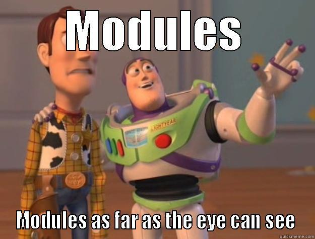

# 0x02. Python - import & modules

## Resources
### Read or watch:

- [Modules](https://docs.python.org/3/tutorial/modules.html)
- [Command line arguments](https://docs.python.org/3/tutorial/stdlib.html#command-line-arguments)
- [Pycodestyle -- Style Guide for Python Code](https://pypi.org/project/pycodestyle/)

### man or help:

- `python3`

## Learning Objectives
At the end of this project, you are expected to be able to [explain to anyone](https://fs.blog/feynman-learning-technique/), **without the help of Google:**

## General
- Why Python programming is awesome
- How to import functions from another file
- How to use imported functions
- How to create a module
- How to use the built-in function `dir()`
- How to prevent code in your script from being executed when imported
- How to use command line arguments with your Python programs

## Copyright - Plagiarism
- You are tasked to come up with solutions for the tasks below yourself to meet with the above learning objectives.
- You will not be able to meet the objectives of this or any following project by copying and pasting someone else's work.
- You are not allowed to publish any content of this project.
- Any form of plagiarism is strictly forbidden and will result in removal from the program.

## Directory Contents
___

This directory contains the following files:

