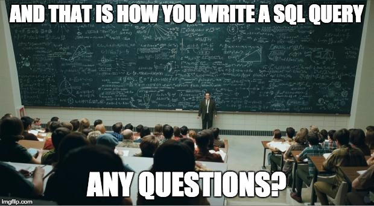

# 0x0D. SQL - Introduction

## Resources
### Read or watch:

- [What is Database & SQL?](https://www.youtube.com/watch?v=FR4QIeZaPeM)
- [A Basic MySQL Tutorial](https://www.digitalocean.com/community/tutorials/how-to-install-mysql-on-ubuntu-20-04)
- [What makes the big difference between a backtick and an apostrophe?](https://stackoverflow.com/questions/29402361/what-makes-the-big-difference-between-a-backtick-and-an-apostrophe/29402458)
- [MySQL Cheat Sheet](https://intellipaat.com/mediaFiles/2019/02/SQL-Commands-Cheat-Sheet.pdf?US)
- [MySQL 8.0 SQL Statement Syntax](https://dev.mysql.com/doc/refman/8.0/en/sql-statements.html)
- installing MySQL in Ubuntu 20.04
- Basic SQL statements: DDL and DML (focus on the DDL and DML part only in the link)
- SQL Aggregate functions
- SQL Select Query
- SQL Subqueries
