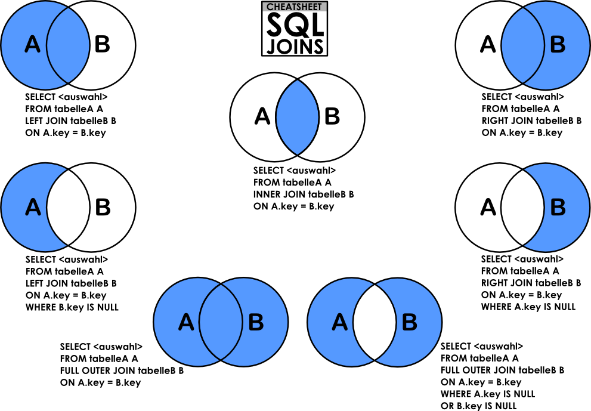

# 0x0E. SQL - More queries


## Resources
### Read or watch:

- [How To Create a New User and Grant Permissions in MySQL](https://www.digitalocean.com/community/tutorials/how-to-create-a-new-user-and-grant-permissions-in-mysql)
- [How To Use MySQL GRANT Statement To Grant Privileges To a User](https://www.mysqltutorial.org/mysql-administration/mysql-grant/)
- [MySQL constraints](https://zetcode.com/mysql/constraints/)
- SQL technique: subqueries
- Basic query operation: the join
- SQL technique: multiple joins and the distinct keyword
- SQL technique: join types
- SQL technique: union and minus

Use the following link for the above `https://home.csulb.edu/~dbrown/CECS323/`

- [MySQL Cheat Sheet](https://intellipaat.com/mediaFiles/2019/02/SQL-Commands-Cheat-Sheet.pdf?US)
- [The Seven Types of SQL Joins](https://tableplus.com/blog/2018/09/a-beginners-guide-to-seven-types-of-sql-joins.html)
- [MySQL Tutorial](https://www.youtube.com/watch?v=yPu6qV5byu4)
- [SQL Style Guide](https://www.sqlstyle.guide/)
- [MySQL 8.0 SQL Statement Syntax](https://dev.mysql.com/doc/refman/8.0/en/sql-statements.html)
- [SQL Subqueries](https://www.geeksforgeeks.org/sql/sql-subquery/)
- [SQL Join](https://www.geeksforgeeks.org/sql/sql-join-set-1-inner-left-right-and-full-joins/)
- [More on SQL Joins (focus on joins)](https://launchschool.com/books/sql/read/joins)
- [SQL Distinct keyword](https://www.w3schools.com/sql/sql_distinct.asp)
- [SQL union, minus, and intersect operations](https://docs.exasol.com/db/latest/sql/table_operators.htm)

Extra resources around relational database model design:

- [Design](https://www.guru99.com/database-design.html)
- [Normalization](https://www.guru99.com/database-normalization.html)
- [ER Modeling](https://www.guru99.com/er-modeling.html)

## Learning Objectives
At the end of this project, you are expected to be able to [explain to anyone](https://fs.blog/feynman-learning-technique/), **without the help of Google:**

## General
- How to create a new MySQL user
- How to manage privileges for a user to a database or table
- What’s a `PRIMARY KEY`
- What’s a `FOREIGN KEY`
- How to use `NOT NULL` and `UNIQUE` constraints
- How to retrieve datas from multiple tables in one request
- What are subqueries
- What are `JOIN` and `UNION`

## More Info
## Comments for your SQL file:
```
$ cat my_script.sql
-- 3 first students in the Batch ID=3
-- because Batch 3 is the best!
SELECT id, name FROM students WHERE batch_id = 3 ORDER BY created_at DESC LIMIT 3;
$
```
## Install MySQL 8.0 on Ubuntu 20.04 LTS
```
$ sudo apt update
$ sudo apt install mysql-server
...
$ mysql --version
mysql  Ver 8.0.25-0ubuntu0.20.04.1 for Linux on x86_64 ((Ubuntu))
$
```
Connect to your MySQL server:
```
$ sudo mysql
Welcome to the MySQL monitor.  Commands end with ; or \g.
Your MySQL connection id is 11
Server version: 8.0.25-0ubuntu0.20.04.1 (Ubuntu)

Copyright (c) 2000, 2021, Oracle and/or its affiliates.

Oracle is a registered trademark of Oracle Corporation and/or its
affiliates. Other names may be trademarks of their respective
owners.

Type 'help;' or '\h' for help. Type '\c' to clear the current input statement.

mysql>
mysql> quit
Bye
$
```
## Use “container-on-demand” to run MySQL
**In the container, credentials are** `root/root`

- Ask for container `Ubuntu 20.04`
- Connect via SSH
- OR connect via the Web terminal
- In the container, you should start MySQL before playing with it:
```
$ service mysql start                                                   
 * Starting MySQL database server mysqld 
$
$ cat 0-list_databases.sql | mysql -uroot -p                               
Database                                                                                   
information_schema                                                                         
mysql                                                                                      
performance_schema                                                                         
sys                      
$
```
**In the container, credentials are** `root/root`
## How to import a SQL dump
```
$ echo "CREATE DATABASE hbtn_0d_tvshows;" | mysql -uroot -p
Enter password: 
$ curl "https://s3.amazonaws.com/intranet-projects-files/holbertonschool-higher-level_programming+/274/hbtn_0d_tvshows.sql" -s | mysql -uroot -p hbtn_0d_tvshows
Enter password: 
$ echo "SELECT * FROM tv_genres" | mysql -uroot -p hbtn_0d_tvshows
Enter password: 
id  name
1   Drama
2   Mystery
3   Adventure
4   Fantasy
5   Comedy
6   Crime
7   Suspense
8   Thriller
$
```




## Contents
## This Directory contains the following files

## [0-privileges.sql](0-privileges.sql)
Write a script that lists all privileges of the MySQL users `user_0d_1` and `user_0d_2` on your server (in `localhost`).
```
guillaume@ubuntu:~/$ cat 0-privileges.sql | mysql -hlocalhost -uroot -p
Enter password: 
ERROR 1141 (42000) at line 3: There is no such grant defined for user 'user_0d_1' on host 'localhost'
guillaume@ubuntu:~/$ 
guillaume@ubuntu:~/$ echo "CREATE USER 'user_0d_1'@'localhost';" |  mysql -hlocalhost -uroot -p
Enter password: 
guillaume@ubuntu:~/$ echo "GRANT ALL PRIVILEGES ON *.* TO 'user_0d_1'@'localhost';" |  mysql -hlocalhost -uroot -p
Enter password: 
guillaume@ubuntu:~/$ cat 0-privileges.sql | mysql -hlocalhost -uroot -p
Enter password: 
Grants for user_0d_1@localhost                                                                                                
GRANT SELECT, INSERT, UPDA..., DROP ROLE ON *.* TO `user_0d_1`@`localhost`                                                                                                                             
GRANT APPLICATION_PASSWORD_ADMIN,AUDIT...,XA_RECOVER_ADMIN ON *.* TO `user_0d_1`@`localhost`                                        
ERROR 1141 (42000) at line 4: There is no such grant defined for user 'user_0d_2' on host 'localhost'              
guillaume@ubuntu:~/$ 
```
## [1-create_user.sql](1-create_user.sql)
Write a script that creates the MySQL server user `user_0d_1`.

- `user_0d_1` should have all privileges on your MySQL server
- The `user_0d_1` password should be set to `user_0d_1_pwd`
- If the user `user_0d_1` already exists, your script should not fail
```
guillaume@ubuntu:~/$ cat 1-create_user.sql | mysql -hlocalhost -uroot -p
Enter password: 
guillaume@ubuntu:~/$ cat 0-privileges.sql | mysql -hlocalhost -uroot -p
Enter password: 
Grants for user_0d_1@localhost                                                                                                
GRANT SELECT, INSERT..., DROP ROLE ON *.* TO `user_0d_1`@`localhost`                                                                                                                             
GRANT APPLICATION_PASSWORD_ADMIN,...,XA_RECOVER_ADMIN ON *.* TO `user_0d_1`@`localhost`                                        
ERROR 1141 (42000) at line 4: There is no such grant defined for user 'user_0d_2' on host 'localhost'
guillaume@ubuntu:~/$ 
```
## [2-create_read_user.sql](2-create_read_user.sql)
Write a script that creates the database `hbtn_0d_2` and the user `user_0d_2`.

- `user_0d_2` should have only SELECT privilege in the database `hbtn_0d_2`
- The `user_0d_2` password should be set to `user_0d_2_pwd`
- If the database `hbtn_0d_2` already exists, your script should not fail
- If the user `user_0d_2` already exists, your script should not fail
```
guillaume@ubuntu:~/$ cat 2-create_read_user.sql | mysql -hlocalhost -uroot -p
Enter password: 
guillaume@ubuntu:~/$ cat 0-privileges.sql | mysql -hlocalhost -uroot -p
Enter password: 
Grants for user_0d_1@localhost                                                                                                
GRANT SELECT, ..., DROP ROLE ON *.* TO `user_0d_1`@`localhost`                                                                                                                             
GRANT APPLICATION_PASSWORD_ADMIN,...,XA_RECOVER_ADMIN ON *.* TO `user_0d_1`@`localhost`                                        
Grants for user_0d_2@localhost                                                                                                
GRANT USAGE ON *.* TO `user_0d_2`@`localhost`                                                                                 
GRANT SELECT ON `hbtn_0d_2`.* TO `user_0d_2`@`localhost`  
guillaume@ubuntu:~/$ 
```
